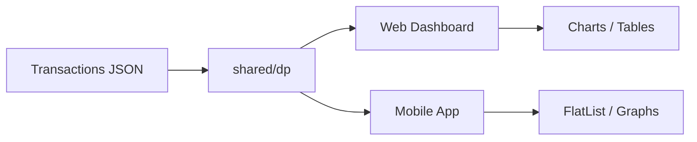

# Day 60 — Machine Coding (Full Stack Capstone)

**React + React Native Combined Project Guide**  
**Project:** Personal Finance Tracker with DP-powered insights

---

## Table of Contents

1. [Project Overview](#1-project-overview)
2. [Architecture](#2-architecture)
3. [Shared Business Logic](#3-shared-business-logic)
4. [React Web App](#4-react-web-app)
5. [React Native App](#5-react-native-app)
6. [Mock Interview Walkthrough (45 min)](#6-mock-interview-walkthrough-45-min)
7. [Evaluation Rubric](#7-evaluation-rubric)
8. [Stretch Goals](#8-stretch-goals)

---

## 1. Project Overview

Build a **Personal Finance Tracker** that uses DP algorithms from Week 8:

| Feature | DP Algorithm | Day |
|---------|--------------|-----|
| Budget allocation | 0/1 Knapsack | 52 |
| Savings streak | LIS on daily saves | 54 |
| Stock portfolio | Max profit k=2 | 57 |
| Bill diff / merge | Edit distance | 59 |

**Deliverables:** Working React web dashboard + React Native mobile view sharing core logic.

---

## 2. Architecture

```
packages/
  shared/
    dp/
      knapsack.ts
      lis.ts
      stock.ts
      editDistance.ts
    types/
      transaction.ts
  web/          # React (Vite)
  mobile/       # React Native (Expo)
```

### Data flow



---

## 3. Shared Business Logic

### types/transaction.ts

```ts
export type Transaction = {
  id: string;
  date: string;
  amount: number;
  category: string;
  note?: string;
};

export type BudgetItem = {
  id: string;
  name: string;
  cost: number;
  value: number;
};
```

### dp/knapsack.ts

```ts
export function knapsack01(
  items: { id: string; cost: number; value: number }[],
  capacity: number
): { maxValue: number; selected: string[] } {
  const dp = Array(capacity + 1).fill(0);
  const pick: string[][] = Array.from({ length: capacity + 1 }, () => []);

  for (const item of items) {
    for (let w = capacity; w >= item.cost; w--) {
      const candidate = dp[w - item.cost] + item.value;
      if (candidate > dp[w]) {
        dp[w] = candidate;
        pick[w] = [...pick[w - item.cost], item.id];
      }
    }
  }
  return { maxValue: dp[capacity], selected: pick[capacity] };
}
```

### dp/stock.ts

```ts
export function maxProfitTwoTransactions(prices: number[]): number {
  let b1 = -Infinity, s1 = 0, b2 = -Infinity, s2 = 0;
  for (const p of prices) {
    b1 = Math.max(b1, -p);
    s1 = Math.max(s1, b1 + p);
    b2 = Math.max(b2, s1 - p);
    s2 = Math.max(s2, b2 + p);
  }
  return s2;
}
```

### dp/lis.ts

```ts
export function longestIncreasingStreak(values: number[]): number {
  const dp = values.map(() => 1);
  for (let i = 1; i < values.length; i++) {
    for (let j = 0; j < i; j++) {
      if (values[j] < values[i]) dp[i] = Math.max(dp[i], dp[j] + 1);
    }
  }
  return Math.max(...dp, 0);
}
```

### dp/editDistance.ts

```ts
export function minDistance(a: string, b: string): number {
  const m = a.length, n = b.length;
  const dp = Array.from({ length: m + 1 }, () => Array(n + 1).fill(0));
  for (let i = 0; i <= m; i++) dp[i][0] = i;
  for (let j = 0; j <= n; j++) dp[0][j] = j;
  for (let i = 1; i <= m; i++) {
    for (let j = 1; j <= n; j++) {
      dp[i][j] = a[i - 1] === b[j - 1]
        ? dp[i - 1][j - 1]
        : 1 + Math.min(dp[i - 1][j], dp[i][j - 1], dp[i - 1][j - 1]);
    }
  }
  return dp[m][n];
}
```

---

## 4. React Web App

### Dashboard component

```tsx
import { useState, useMemo } from "react";
import { knapsack01 } from "@shared/dp/knapsack";
import { maxProfitTwoTransactions } from "@shared/dp/stock";

const BUDGET_ITEMS = [
  { id: "1", name: "Emergency fund", cost: 500, value: 10 },
  { id: "2", name: "Index fund", cost: 300, value: 8 },
  { id: "3", name: "Course", cost: 200, value: 7 },
];

const STOCK_PRICES = [100, 110, 95, 120, 115, 130];

export default function FinanceDashboard() {
  const [budget, setBudget] = useState(700);
  const allocation = useMemo(() => knapsack01(BUDGET_ITEMS, budget), [budget]);
  const stockProfit = useMemo(() => maxProfitTwoTransactions(STOCK_PRICES), []);

  return (
    <main style={{ padding: 24, fontFamily: "system-ui" }}>
      <h1>Finance Dashboard</h1>

      <section>
        <h2>Budget Allocation (Knapsack)</h2>
        <input type="range" min={0} max={1000} value={budget} onChange={(e) => setBudget(+e.target.value)} />
        <p>Budget: ${budget} · Max value: {allocation.maxValue}</p>
        <ul>
          {BUDGET_ITEMS.map((item) => (
            <li key={item.id} style={{ fontWeight: allocation.selected.includes(item.id) ? 700 : 400 }}>
              {item.name} (${item.cost})
            </li>
          ))}
        </ul>
      </section>

      <section>
        <h2>Portfolio (2 transactions max)</h2>
        <p>Optimal profit: ${stockProfit}</p>
      </section>
    </main>
  );
}
```

---

## 5. React Native App

```tsx
import { View, Text, FlatList, StyleSheet, TextInput } from "react-native";
import { useState, useMemo } from "react";
import { longestIncreasingStreak } from "@shared/dp/lis";
import { minDistance } from "@shared/dp/editDistance";

const SAVINGS = [10, 20, 15, 25, 30, 28, 35];
const CATEGORIES = ["food", "rent", "transport", "foodd", "utilities"];

export default function FinanceMobile() {
  const [query, setQuery] = useState("foodd");
  const streak = useMemo(() => longestIncreasingStreak(SAVINGS), []);
  const suggestions = useMemo(
    () =>
      CATEGORIES.map((c) => ({ c, d: minDistance(query, c) }))
        .filter((x) => x.d <= 2)
        .sort((a, b) => a.d - b.d),
    [query]
  );

  return (
    <View style={styles.container}>
      <Text style={styles.title}>Savings streak (LIS): {streak} days</Text>

      <Text style={styles.label}>Category autocorrect</Text>
      <TextInput style={styles.input} value={query} onChangeText={setQuery} />

      <FlatList
        data={suggestions}
        keyExtractor={(item) => item.c}
        renderItem={({ item }) => (
          <Text style={styles.suggestion}>{item.c} (cost {item.d})</Text>
        )}
      />

      <Text style={styles.section}>Daily savings</Text>
      <FlatList
        horizontal
        data={SAVINGS}
        keyExtractor={(_, i) => String(i)}
        renderItem={({ item }) => (
          <View style={styles.bar}><Text>${item}</Text></View>
        )}
      />
    </View>
  );
}

const styles = StyleSheet.create({
  container: { flex: 1, padding: 16 },
  title: { fontSize: 20, fontWeight: "600", marginBottom: 16 },
  label: { marginTop: 12 },
  input: { borderWidth: 1, borderColor: "#ccc", borderRadius: 8, padding: 10, marginVertical: 8 },
  suggestion: { paddingVertical: 8 },
  section: { marginTop: 24, fontWeight: "500" },
  bar: { backgroundColor: "#c8e6c9", padding: 12, marginRight: 8, borderRadius: 8 },
});
```

---

## 6. Mock Interview Walkthrough (45 min)

| Minute | Task |
|--------|------|
| 0–5 | Clarify: budget slider, show knapsack selection |
| 5–20 | Implement `knapsack01` + web UI |
| 20–35 | Port streak + autocorrect to RN |
| 35–40 | Error states, empty data |
| 40–45 | Explain shared package, test strategy |

### Interviewer questions

- "Why reverse loop in 0/1 knapsack?"
- "How would you persist transactions?"
- "How to test DP functions?"

---

## 7. Evaluation Rubric

| Criteria | Points |
|----------|--------|
| Shared logic extracted | 3 |
| Web UI functional | 3 |
| RN UI functional | 3 |
| Correct DP usage | 4 |
| Code quality / types | 2 |

**Pass:** 12+ / 15

---

## 8. Stretch Goals

- [ ] Monorepo with Turborepo
- [ ] Persist to AsyncStorage / localStorage
- [ ] Chart.js / Victory Native for stock graph
- [ ] Unit tests for all DP modules (Jest)
- [ ] Storybook for web components

---

**Prev/Next:** [Concepts](day60_concepts.md) · [LeetCode Mock Contest](day60_leetcode.md)
